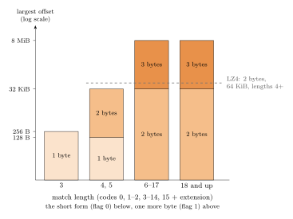
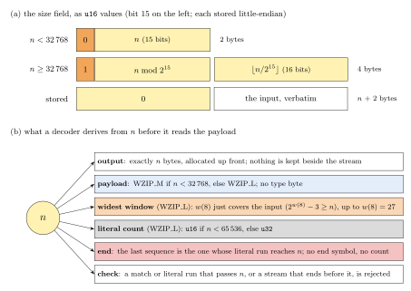
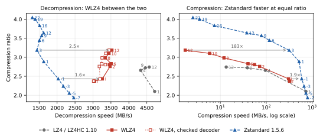

# WZIP and WLZ4

Two LZ77 codecs built on **match-length-dependent sliding windows**: each match length has its own maximum
distance, so short matches use short, cheap offsets while long matches reach the whole history. Lengths are decoded
before offsets, so the decoder knows each match's window and no extra field is sent.

- **WZIP** is an entropy-coded, Zstandard-class codec (Huffman coding only), in three formats, because what pays on a
  large input costs too much on a small one ([comparison](#the-three-wzip-variants)):
  - **WZIP_L**, for inputs of 32 KB and more, sizes its windows to the input (up to 128 MB) and sends fresh Huffman
    tables, among them a 1020-symbol joint code, every 16,384 sequences: rich statistics whose description pays off
    on a large input.
  - **WZIP_M**, below 32 KB, sends one set of small tables, fixes its windows (8 KB for length 3, 32 KB beyond) so
    that no window header is needed, and splits its sequences into two streams that the decoder reads in parallel.
  - **WZIP_S**, for independent 4-8 KB storage pages, spends one header byte per page, reuses its context and a
    prepared dictionary across pages instead of rebuilding them, and adds features for short blocks: repeat offsets
    preset to 1, 4 and 8, length-2 matches at the last offset, and a two-byte form for a page of one repeated byte.

  `wzip_compress` picks WZIP_L or WZIP_M from the input size, which the stream records; WZIP_S has its own interface.
- **WLZ4** is a byte-aligned, LZ4-class codec with one offset rule: a one-byte offset for length 3, and for longer
  matches a flagged offset of 1 + (length >= 6) bytes, or one more when the flag is set: one or two bytes (128 B or
  32 KB) for lengths 4-5, two or three (32 KB or 8 MB) from length 6. It sits between LZ4 and Zstandard, nearer
  LZ4: on Silesia it reaches Zstandard 3's ratio and decodes twice as fast, at 71-83% of LZ4's speed, but compresses
  more slowly than Zstandard ([where WLZ4 sits](#where-wlz4-sits-between-lz4-and-zstandard)).



*How far back a WLZ4 match can reach, by length and offset-field size, against LZ4's single 64 KB window
([more figures](doc/WLZ4_format.md)).*

**The decoded size comes first.** Every WZIP and WLZ4 stream begins with its decoded size: 2 bytes below 32 KB, else
4 (WZIP_S: two bits of its header byte for 4, 8 or 16 KB pages). A decoder therefore allocates its output exactly,
with no size kept beside the data (the LZ4 block format records none, LZ4 and Zstandard frames only optionally), and
checks that decoding ends exactly there. WZIP gets more from it: which format follows (a size of 0 marks stored
input), the window of WZIP_L's longest matches, which just covers the input, and the end of the stream: the last sequence
is the one whose literals reach that size, so no end-of-block symbol or sequence count is coded. Incompressible input
grows by at most 2 bytes with WZIP and 15 with WLZ4.



*The size field of a `wzip_compress` stream, and what a decoder derives from it before reading the payload
([format](doc/WZIP_format.md#41-the-one-call-stream)).*

**Dictionary compression, simpler than zstd's.** A dictionary is just the history before the input, at negative
positions: one address space, one sign test to locate a match's source, and one chain walk over dictionary and input
together. WZIP_S indexes a dictionary once and shares it read-only across blocks, contexts and threads, never copying
or re-indexing it. See [Dictionary compression](#dictionary-compression).

## Results

Single thread, Intel Core i7-8850H, GCC 14.2 `-O2`; each file compressed whole. Ratio is total input over total
output; speeds in MB/s. Full tables, the harness and the raw outputs are in [`bench/`](bench) and [`results/`](results).
LZ4 and WLZ4 were measured again together after WLZ4's 2026-10 format revision, in a later session than the others.
WZIP and WLZ4 decode in their trusted mode here, as in the paper (see Usage); their default, bounds-checked decoders
are 9-13% (WLZ4) and at most 8% (WZIP) slower on Silesia.

| Silesia (212 MB, 12 files) | Ratio | Compress | Decompress |
|---|---:|---:|---:|
| LZ4HC 12 | 2.743 | 10.9 | 3361 |
| **WLZ4 2** | 2.758 | 45.0 | 2733 |
| **WLZ4 12** | 3.186 | 1.08 | 2429 |
| Zstandard 19 | 4.005 | 2.57 | 1006 |
| Zstandard 22 | 4.045 | 1.93 | 967 |
| **WZIP 11** | 4.080 | 1.40 | 812 |
| **WZIP 13** | 4.097 | 0.62 | 752 |
| Brotli 11 | 4.276 | 0.47 | 383 |
| xz -9e | 4.374 | 1.90 | 119 |

| enwik9 (1 GB of Wikipedia) | Ratio | Compress | Decompress |
|---|---:|---:|---:|
| Zstandard 22 | 4.676 | 1.25 | 675 |
| xz -9e | 4.722 | 1.34 | 136 |
| **WZIP 11** | 4.745 | 0.92 | 492 |
| **WZIP 13** | 4.759 | 0.42 | 484 |

### Where WLZ4 sits between LZ4 and Zstandard



*Silesia, LZ4, WLZ4 and Zstandard measured in one session (`bench/run_position.sh`). Labels are levels, with f
and l for WLZ4's fast and lazy modes; Zstandard's negative levels are its `--fast` modes. Hollow squares: WLZ4's
default, bounds-checked decoder. Arrows join configurations of equal ratio, labeled with the speed ratio.*

In ratio and decompression speed WLZ4 lies between LZ4 and Zstandard, nearer LZ4; in compression speed it does not.

- **Decompression.** WLZ4 decodes at 2.3-2.7 GB/s in trusted mode, 71-83% of LZ4HC 12's 3.3 GB/s, and at
  2.1-2.4 GB/s with its default, bounds-checked decoder (LZ4 and Zstandard are measured with their checked
  decoders); Zstandard's levels -7 to 9 decode at 1.1-1.9 GB/s. At equal ratio WLZ4 decodes 1.7-2.1 times as fast
  as Zstandard (checked decoder: 1.5-2.0): the lazy mode against Zstandard -1 (ratio 2.43), level 12 against
  Zstandard 3 (3.19).
- **Ratio.** WLZ4's levels span 2.37-3.19, from 13% above LZ4's default mode to Zstandard 3's ratio, 16% above
  LZ4HC 12's. Zstandard's higher levels go further (3.57 at level 9, 4.05 at 22), as does WZIP.
- **Compression speed.** At a given ratio WLZ4 compresses more slowly than Zstandard. Its fast and lazy modes run at
  230-260 MB/s, against 630 MB/s for LZ4 and 440 MB/s for Zstandard -1, which matches the lazy mode's ratio;
  Zstandard 3 reaches level 12's ratio 200 times as fast. Against LZ4HC, WLZ4 compares well: level 2 exceeds
  LZ4HC 12's ratio at 4.3 times its compression speed.

WLZ4 therefore suits data compressed once and decompressed many times (read-mostly storage, software packages,
game and web assets), where decoding near LZ4's speed matters more than encoding speed. For data compressed on the
fly, LZ4 and Zstandard's fast levels are the better choice. Configurations measured earlier (the tables above and
`results/`) have the same ratios here; their speeds, from a separate session, differ by up to 4% in decompression
and 7% in compression.

<details><summary>All points of the figure</summary>

| Codec, level | Ratio | Compress | Decompress (checked) |
|---|---:|---:|---:|
| LZ4 1 | 2.101 | 632 | 3285 |
| LZ4HC 4 | 2.656 | 72.4 | 3095 |
| LZ4HC 9 | 2.721 | 31.8 | 3226 |
| LZ4HC 12 | 2.743 | 10.7 | 3301 |
| **WLZ4 fast** | 2.373 | 257 | 2539 (2254) |
| **WLZ4 lazy** | 2.432 | 228 | 2700 (2426) |
| **WLZ4 2** | 2.758 | 45.7 | 2658 (2384) |
| **WLZ4 4** | 2.805 | 36.1 | 2705 (2448) |
| **WLZ4 6** | 2.830 | 26.3 | 2728 (2433) |
| **WLZ4 8** | 2.984 | 7.8 | 2396 (2146) |
| **WLZ4 10** | 3.101 | 3.9 | 2378 (2126) |
| **WLZ4 12** | 3.186 | 1.1 | 2330 (2151) |
| Zstandard -7 | 1.937 | 600 | 1858 |
| Zstandard -5 | 2.056 | 555 | 1784 |
| Zstandard -3 | 2.239 | 498 | 1666 |
| Zstandard -1 | 2.437 | 440 | 1570 |
| Zstandard 1 | 2.887 | 400 | 1240 |
| Zstandard 3 | 3.186 | 230 | 1103 |
| Zstandard 6 | 3.444 | 88.6 | 1153 |
| Zstandard 9 | 3.570 | 49.5 | 1177 |

</details>

### Independent 4 KB and 8 KB blocks

Storage pages and key-value stores compress small blocks independently. Here every Silesia file is cut into 4 KB
or 8 KB blocks, each compressed and decompressed by its own call (`bench/bench_blocks.c`; results for
Canterbury+Calgary are in [`results/blocks_C.txt`](results/blocks_C.txt) and, for the LZ4 class,
[`results/blocks_lz4class_C.txt`](results/blocks_lz4class_C.txt)).

| Silesia in blocks | 4 KB ratio | Compress | Decompress | 8 KB ratio | Compress | Decompress |
|---|---:|---:|---:|---:|---:|---:|
| LZ4 | 1.727 | 590 | 2719 | 1.824 | 581 | 2783 |
| LZ4HC 12 | 1.856 | 36.2 | 2973 | 2.004 | 30.3 | 3061 |
| **WLZ4 2** | 1.901 | 67.0 | 2495 | 2.027 | 67.2 | 2671 |
| **WLZ4 10** | 1.945 | 24.5 | 2317 | 2.087 | 23.1 | 2462 |
| Zstandard 1 | 2.315 | 210 | 571 | 2.476 | 251 | 699 |
| Zstandard 9 | 2.424 | 33.3 | 599 | 2.619 | 28.4 | 693 |
| Zstandard 19 | 2.522 | 3.88 | 530 | 2.737 | 3.80 | 636 |
| **WZIP_S 1** | 2.434 | 52.3 | 314 | 2.580 | 59.3 | 410 |
| **WZIP_S 5** | 2.499 | 31.7 | 330 | 2.680 | 30.8 | 424 |
| **WZIP_S 9** | 2.500 | 24.2 | 332 | 2.682 | 17.6 | 424 |
| **WZIP_M 12** | 2.502 | 0.82 | 379 | 2.718 | 0.51 | 479 |

WZIP_S 1 compresses 5% more than Zstandard 1 on 4 KB blocks, and WZIP_S 5 3% more than Zstandard 9 at the same
compression speed, but WZIP_S decodes at 55-61% of Zstandard's speed, and Zstandard 19 still compresses 1-2% more
than WZIP_S 9. WLZ4 compresses 1-5% more than LZ4HC 12, decoding 13-22% slower (the LZ4 rows were measured again
with WLZ4 after its format revision, in a later session than the others). WZIP_M, reached through
`wzip_compress`, compresses slowly on small blocks because the one-call interface builds its tables on every call;
WZIP_S keeps them in a reusable context.

## Papers

- Y. Wu, "WZIP and WLZ4: LZ77 codecs with match-length-dependent sliding windows," submitted to the 2027
  Data Compression Conference ([preprint PDF](papers/WZIP_WLZ4_DCC.pdf)). Describes both codecs, their optimal
  parser and the measurements above.
- Y. Wu, "Improved LZ77 compression with match-length-dependent sliding windows," submitted to IEEE Transactions on
  Information Theory ([preprint PDF](papers/WLZ.pdf)). Analyzes the scheme: universality of greedy parsing, schedule
  calibration, run and period gains, and exact minimum-cost parsing.
- Y. Wu, "Improved LZ77 compression," in Proc. Data Compression Conference, 2021, p. 377. Introduces the scheme.

## Format specifications

The papers measure the codecs; the formats themselves are specified in [`doc/`](doc), precisely enough to write
an independent decoder, together with the reference decoders' techniques and the encoders' levels, and illustrated
with figures of every layout:

- [`doc/WLZ4_format.md`](doc/WLZ4_format.md): the WLZ4 block, with a byte-by-byte worked example;
- [`doc/WZIP_format.md`](doc/WZIP_format.md): the `wzip_compress` stream (WZIP_L, WZIP_M) and WZIP_S blocks;
- [`doc/frame_format.md`](doc/frame_format.md): the WZ frame, the container for files: magic number, codec and
  format version, blocks of bounded size, content size and XXH32 checksum.

Each comes with a small decoder written from the specification alone ([`doc/wlz4_decode.py`](doc/wlz4_decode.py),
[`doc/wzip_decode.py`](doc/wzip_decode.py), [`doc/frame_decode.py`](doc/frame_decode.py)), which checks every
rule and decodes the output of every encoder level identically; they are slow, and meant as executable references.

## Build and test

```sh
make          # build/libwzip.a and build/roundtrip
make test     # round trip of every codec and level on synthetic inputs, with guard checks on every buffer
make check FILES="file1 file2"
make fuzz     # damaged streams of every codec, under AddressSanitizer and UndefinedBehaviorSanitizer (Linux, macOS)
```

The sources (`src/`) are C99 and build without warnings (`-Wall`) with GCC 14.2 (MinGW-w64, Windows), and GCC 11.4
and clang 14 (Ubuntu 22.04, x86-64), where the tests also pass under AddressSanitizer and UndefinedBehaviorSanitizer.
On x86 the decoders pick BMI2 code paths at run time.

The default decoders validate their input, as LZ4's safe decoder does: whatever the stream, a decoder reads nothing
outside the compressed buffer (and the dictionary) and writes nothing outside the output buffer; a corrupt or truncated
stream returns 0. `make fuzz` decodes flipped, overwritten, truncated, spliced and extended streams of every codec from
buffers of exactly their size, so that the sanitizers catch any stray access; it also decodes each undamaged stream
from such a buffer, and in trusted mode from a buffer with exactly the documented slack.

## Usage

For files, or whenever the data must identify itself, use the WZ frame (`wzframe.h`): it records the codec and its
format version, splits content of any size into blocks, and checks an XXH32 checksum. Its functions take `size_t`
sizes and return error codes.

```c
#include "wzframe.h"

WZF_params p = { WZF_CODEC_WLZ4, 10, 0, 0 };          /* codec, level, block size log (0: auto), noChecksum */
size_t cap = WZF_compressBound(n, &p);
size_t cSize = WZF_compress(dst, cap, src, n, &p);    /* check WZF_isError(cSize) */

unsigned long long size = WZF_getContentSize(dst, cSize);
size_t dSize = WZF_decompress(out, size, dst, cSize); /* the content size, or an error: WZF_getErrorName(dSize) */
```

`WZF_compressBegin`/`Block`/`End` and `WZF_decompressBegin`/`nextBlock`/`Block`/`End` do the same block by block,
for content that does not fit in memory. The codecs' own one-call functions below produce bare streams, without
identification or checksum, for applications that store sizes and codecs themselves:

```c
#include "WZIP.h"

int cap = WZIP_Cap_CmprSize(n);                       /* input + 256 always suffices */
int cSize = wzip_compress(src, n, dst, &cap, 11);     /* level 0-13; 0 on failure */

int decCap = n;                                       /* the decoded size, also given by WZIP_Read_DecSize */
int dSize = wzip_decompress(dst, cSize, out, &decCap);
```

```c
#include "WLZ4.h"

WLZhc_State_Str* hc = WLZhc_New_State();
unsigned cSize = WLZhc_Compress(hc, src, dst, n, WLZ_COMPRESSBOUND(n), 10);   /* level 0-12 */
unsigned dSize = WLZ_Decompress(dst, out, cSize, n + WLZ_MEM_OVERHEAD);      /* out holds n + WLZ_MEM_OVERHEAD */
WLZhc_Free_State(hc);
```

WZIP_S, for 4 KB and 8 KB blocks, has its own interface (below).

### Trusted mode (opt-in)

The default decoders check every stream (below). For data known to come unmodified from these encoders, such as
data your own program compressed or data verified by a cryptographic MAC, an opt-in trusted mode decodes without any
check. Because every stream begins with its decoded size, it needs nothing from the caller: the output is sized from
the stream, as in the default mode. The compressed buffer must stay readable `WZIP_TRUSTED_SRC_PAD` or
`WLZ_TRUSTED_SRC_PAD` (32) bytes past the stream.

```c
int dSize = wzip_decompress_trusted(dst, cSize, out, &decCap);                         /* WZIP */
unsigned dSize = WLZ_Decompress_Trusted(dst, out, cSize, n + WLZ_MEM_OVERHEAD);        /* WLZ4 */
```

On Silesia the trusted mode decodes 9-15% faster for WLZ4 and up to 8% faster for WZIP. Never use it on data that
may be damaged or crafted: a bad stream can make it read or write out of bounds.

## Limitations

- WZIP_L and WZIP_M keep their window schedule in global state: use them from one thread at a time. WZIP_S and WLZ4
  keep their state in contexts.
- WZIP's optimal levels (7-13) need about 950 MB of encoder memory on a 50 MB input and about 2 GB on enwik9. Inputs
  are limited to 2 GB, and windows to 128 MB.
- A WZIP_L literal run holds at most 2^24 - 1 bytes: an input with about 16 MB in which no match is found (and data
  after it worth compressing) is stored rather than compressed.

## Length-2 matches: measured, not used

Apart from WZIP_S's length-2 match at the most recent offset, every match in these codecs has length 3 or more. A
length-2 match with an offset can pay only at very short distances. In WLZ4 it cannot pay at all: it would need an extra token and an offset byte, as many bytes as
the two literals it replaces. In WZIP it was measured with WZIP_S, whose format has a length-2 symbol with raw offset
bits (`S_W2_BITS`), built with 4 bits (distances up to 16) against 0 (off) (`results/blocks_*.txt`, `wzips-L2`):

| WZIP_S ratio | Cant.+Calg. 4 KB | Cant.+Calg. 8 KB | Silesia 4 KB | Silesia 8 KB |
|---|---:|---:|---:|---:|
| level 5 | 2.7968 | 2.9904 | 2.4989 | 2.6796 |
| level 5, length 2 within 16 bytes | 2.7947 | 2.9891 | 2.4978 | 2.6793 |
| level 9 | 2.7979 | 2.9905 | 2.4997 | 2.6816 |
| level 9, length 2 within 16 bytes | 2.7957 | 2.9893 | 2.4986 | 2.6812 |

Length-2 matches lowered the ratio in every case, by 0.01-0.08%: the two literals they replace cost little after
Huffman coding, while each such match adds a sequence. Their effect on decoding speed was within measurement noise.
So no codec here codes length-2 matches at a distance; WZIP_S keeps only a length-2 match at the most recent offset,
which costs one length symbol and no offset bits.

## The three WZIP variants

All three store the decoded size first, so a decoder allocates its output exactly:

| | WZIP_L | WZIP_M | WZIP_S |
|---|---|---|---|
| Input | 32 KB and up, one block (up to 2 GB) | under 32 KB | one block of up to 32 KB, tuned for 4 KB and 8 KB storage pages |
| API | `wzip_compress` / `wzip_decompress`, which pick L or M by size | the same | `WZIPS_compress` / `WZIPS_decompress` |
| Levels | 0 fast; 1–6 greedy and lazy hash chains; 7–13 optimal parsing | 0–12, optimal parsing at 10–12 | 1–9 |
| Windows | derived from the input size: lengths 8+ reach the whole input (up to 128 MB), shorter lengths less; a 3-byte header lets the encoder widen them | fixed: length 3 within 8 KB, lengths 4+ within 32 KB | length 3 within 4 KB; longer lengths the whole block and dictionary |
| Shortest match | 3 | 3 | 2, at the most recent offset only |
| Repeat offsets | 4, move-to-front | 4, move-to-front | 3 |
| Sequence coding | per block, a joint symbol (repeat slot × literal-run class × length) or separate symbols; offset tables per length group (4, or 8 at level 13); run token | offset tables for lengths 3 and 4+; two interleaved sequence streams | one offset table; offsets in a second stream read backward |
| Literals | Huffman, four streams | Huffman, four streams | Huffman, four streams from 8 KB |
| Dictionary | indexed on each call | indexed on each call | prepared once and shared read-only; matches may cross into the input |
| Worst-case output | input + 2 bytes (stored) | input + 2 bytes (stored) | input + 3 bytes |
| Decoder | bounds-checked; trusted mode opt-in | bounds-checked; trusted mode opt-in | bounds-checked |

## Dictionary compression

A dictionary is the history that precedes the input. WZIP gives that history **negative positions**:
dictionary bytes sit at positions `-dictSize … -1`, the input at `0 … n-1`, and an offset is simply the
distance back into this combined history. Where a match's source lies is one sign test:

```c
source = (pos < 0) ? dictEnd + pos : input + pos;
```

### What this design gives you

zstd addresses dictionary positions through a base pointer and limits, keeps an attached dictionary's tables apart
from the input's and searches them separately, and copies a prepared dictionary into the context for larger inputs
(details in the comparison below). Treating the dictionary as ordinary history removes that bookkeeping:

- **One address space, one test.** Hash tables and chains store history positions. A negative
  position is in the dictionary; there are no base pointers, window limits or index deltas to
  keep consistent.
- **One chain walk.** When a position's previous occurrence lies in the dictionary, its chain link
  simply holds that negative position, and the walk continues through the dictionary's own chain.
  Dictionary and input candidates are searched together, in distance order, by the same loop.
- **Prepare once, share read-only (WZIP_S).** `WZIPS_createCDict` indexes the dictionary once.
  Compressing a block only reads the prepared dictionary: there is no per-block re-indexing, no table
  copy, and one prepared dictionary can serve any number of contexts and threads.
- **Matches may run from the dictionary into the input (WZIP_S)**, exactly as in the concatenated
  history.
- **Safe decoding.** The decoder needs only the dictionary bytes. A block records whether it needs a
  dictionary and fails cleanly without one, and the output never exceeds the stored original size.

### Usage (WZIP_S)

```c
#include "WZIP.h"

WZIPS_CCtx*  cctx  = WZIPS_createCCtx();
WZIPS_CDict* cdict = WZIPS_createCDict(dict, dictSize);   /* built once; its last WZIPS_MAX_DICT bytes are used */

int cSize = WZIPS_compress_usingCDict(cctx, cdict, src, srcSize, dst, WZIPS_COMPRESSBOUND(srcSize), 9);
int dSize = WZIPS_decompress_usingDict(dst, cSize, out, srcSize, dict, dictSize);   /* out needs exactly srcSize bytes */

WZIPS_freeCDict(cdict);
WZIPS_freeCCtx(cctx);
```

WZIP_M and WZIP_L take a dictionary through `WZIP_New_State_M/L` and `WZIP_Decompress_M/L` with the same
negative-position model; they index the dictionary on each call, and their matches stay on one side of
the dictionary end.

### Comparison with zstd

| | WZIP_S | zstd |
|---|---|---|
| Model | dictionary is the history before the input; offsets are distances into it | the same |
| Addressing dictionary positions | negative positions, one sign test | indices relative to a base pointer, with dictionary and low limits; an attached prepared dictionary has its own match state reached through an index delta |
| Searching dictionary and input | one chain walk across both | with an attached dictionary, the input's tables and the dictionary's tables are searched separately |
| Reusing a prepared dictionary | always read-only, never copied or re-indexed | attached read-only for small inputs, copied into the context for larger ones |
| Matches across the dictionary end | yes | yes |
| Identifying the dictionary | one header bit: "dictionary required" | optional dictionary ID of up to 4 bytes |
| Entropy tables in the dictionary | not yet (content only) | yes, in trained dictionaries |
| Dictionary training | not yet | yes (`ZDICT_trainFromBuffer`) |
| Dictionary size used | last 32,767 bytes | up to the window size |

### Measured

Each block of the Silesia files dickens, xml, samba and osdb (first 4 MB of each) was compressed with
the bytes that precede it in the same file as its dictionary: WZIP_S at level 9, and zstd 1.5.6 at
level 19 using the same raw-content dictionary (`ZSTD_compress_usingDict`). Ratio is original size over
compressed size; the gain is the ratio with the dictionary over the ratio without it.

| Block | Dictionary | WZIP_S without → with | WZIP_S gain | zstd without → with | zstd gain |
|------:|-----------:|:---------------------:|------------:|:-------------------:|----------:|
| 4 KB  | 16 KB      | 2.270 → 3.252         | ×1.43       | 2.282 → 3.320       | ×1.45     |
| 4 KB  | 32 KB      | 2.270 → 3.522         | ×1.55       | 2.282 → 3.611       | ×1.58     |
| 16 KB | 32 KB      | 2.810 → 3.722         | ×1.32       | 2.874 → 3.859       | ×1.34     |
| 32 KB | 32 KB      | 3.122 → 3.798         | ×1.22       | 3.219 → 3.958       | ×1.23     |

A dictionary helps WZIP_S about as much as it helps zstd. The remaining 2–4% difference in ratio is the
same as without a dictionary, so it comes from the block coding, not from the dictionary handling.
Decoding with a dictionary ran at the same speed as without on 4 KB blocks and about 16% slower on
16 KB blocks; zstd slowed by about 22% in the same test.

## Repository layout

| Path | Contents |
|---|---|
| `src/` | the codecs: `WZIP.h` (WZIP_L, WZIP_M, WZIP_S), `WLZ4.h`, the frame `wzframe.h`, and their sources |
| `doc/` | format specifications (WZIP, WLZ4, the WZ frame) and reference decoders (Python) |
| `tests/roundtrip.c` | round-trip test of every codec and level (`make test`) |
| `bench/` | the benchmark harness and scripts of the paper (Windows, MSYS2); see `bench/README.md` |
| `results/` | the raw benchmark outputs behind the paper's tables |

## License

BSD 2-Clause (`LICENSE`). Parts of `src/WLZ4.c`, `src/WLZ4.h` and `src/Memry.h` derive from LZ4 and Zstandard;
their licenses are reproduced in `NOTICE`.
