# WZIP formats

This document specifies the compressed formats of WZIP, the entropy-coded codec of this repository (`src/WZIP.h`,
`src/WZIP_*.c`, `src/Huffman_*.c`), precisely enough to write an independent decoder:

- the **one-call stream** of `wzip_compress` (section 4.1), which holds a **WZIP_L** payload for inputs of 32 KiB and
  more (section 5) or a **WZIP_M** payload below (section 6);
- **WZIP_S** blocks, for independent blocks of up to 32 KiB such as storage pages (`WZIPS_compress`, section 7).

Sections 2-7 are normative; sections 8-10 describe the reference implementation and are informative.

`doc/wzip_decode.py` is an independent decoder written from this document alone. It decodes the output of every
`wzip_compress` level (0-13) on Canterbury and Calgary, of levels 1, 9, 11 and 13 on four Silesia files, of edge
inputs (stored, all-equal, long runs, incompressible prefixes, sizes 32767, 32768 and 65536), of WZIP_L and WZIP_M
payloads compressed with a dictionary, and of 14,433 WZIP_S blocks of 4K, 8K, 16K and 5000 bytes at levels 1, 5 and 9
with and without a dictionary, all identically to the input; that is how the specification was checked.

Format version: 2 (October 2026). Version 2 adds **sized sequence blocks** to WZIP_L (sections 5.2 and 5.4), which a
flag in the window header announces; every version 1 stream is a version 2 stream. None of the formats carries a
version field (WZIP_S reserves three header bits, which must be 0). Files and other self-describing data should use
the WZ frame ([`frame_format.md`](frame_format.md)), which records the codec and the format version and adds a
checksum.

## 1. Overview

WZIP is an LZ77 codec with Huffman coding. A parse is a list of *sequences*, each a run of literal bytes followed by
a match `(length, offset)` that copies earlier output; the last sequence has literals only. All literals are coded
apart from the sequences, in their own Huffman-coded stream; each sequence codes its literal-run length, its match
length and its offset with Huffman codes and raw extra bits.

The windows depend on the match length: each length `l` has a window, and an offset coded with a new value must fit
the window of its length (it is coded with an alphabet that holds no larger offsets). In WZIP_L the windows depend
on the input size and on a 3-byte header; in WZIP_M they are fixed (8 KiB for length 3, 32 KiB for longer matches);
in WZIP_S they depend on the block and dictionary sizes. Offsets taken from the cache of recent offsets are not bound
by the windows.

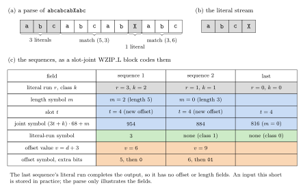

*Figure 1. (a) A parse of `abcabcabXabc`: literals (shaded) and two matches `(length, offset)`. (b) Its literals,
coded apart in the literal stream. (c) Its sequences as a WZIP_L slot-joint block codes them (section 5.5): each
has a joint symbol for its literal-run class, length and cache slot, a literal-run symbol when it has two or more
literals, and an offset symbol with extra bits for a new offset; the last sequence's literal run ends the output.*

**Why three formats.** What pays on a large input costs too much on a small one, and pages stored one by one call for
a different interface:

- **WZIP_L** (`n >= 32768`) adapts to its input: its windows are sized to `n` (up to `2^27` bytes), a 3-byte header
  sets the short lengths' windows, and it sends new Huffman tables for each block of up to 16384 sequences (a
  1020-symbol joint code and four or eight offset codes; from version 2, blocks of sizes the encoder chooses) and
  every 32 KiB of literals, or reuses the last ones. These descriptions cost
  little on a large input.
- **WZIP_M** (`n < 32768`) sends one table header of four small codes (at most 30 symbols each), fixes its windows
  (8 KiB for length 3, 32 KiB for longer matches) so that no window header is needed, and splits its sequences into
  two streams, one read forward and one backward, which a decoder can follow at the same time.
- **WZIP_S** (blocks of up to 32 KiB, tuned for 4 and 8 KiB storage pages) codes common page sizes in its header
  byte and has its own interface, whose context and prepared dictionary are built once and reused across blocks. Its
  format adds three repeat slots preset to 1, 4 and 8, length-2 matches at the most recent offset, and a fill mode
  for a block of one repeated byte.

`wzip_compress` chooses WZIP_L or WZIP_M by `n`, which the stream records.

**The decoded size comes first.** Every WZIP stream begins with its decoded size `n`: 2 or 4 bytes in the one-call
stream (section 4.1), and two bits of the header byte for WZIP_S blocks of 4, 8 or 16 KiB (section 7.1). Before
reading anything else, a decoder can allocate exactly `n` bytes, with no size kept beside the stream; tell which
format follows (a size field of 0 marks a stored stream, of `n + 2` bytes); derive the widest
window of WZIP_L, which just covers the input (section 5.2), and the width of its literal count (section 5.1); and
know where the stream ends: the last sequence is the one whose literal run reaches `n` (sections 5.5, 6.2, 7.4), so
no format codes an end-of-block symbol or a sequence count. Decoding must end at exactly `n` bytes. The LZ4 block
format records no size, and LZ4 and Zstandard frames record it only optionally.


*Figure 2. (a) The size field of a one-call stream, shown as `u16` values with bit 15 on the left (each is stored
little-endian), and a stored stream. (b) What a decoder derives from `n` before it reads the payload.*

## 2. Conventions

- **Byte fields** are little-endian.
- **Bit streams** are MSB-first: the first bit of a stream is bit 7 of its first byte. "`k` bits" denotes an unsigned
  integer read most significant bit first. A stream *ends byte-aligned* when its last byte is padded with zero bits;
  "align" means skipping to the next byte boundary.
- `msb(v)` is the index of the highest set bit of `v > 0` (`msb(1) = 0`).
- `n` is the decoded size.
- A match `(length, offset)` at output position `p` copies the bytes at `p - offset`, ... one at a time in increasing
  order, so a match may overlap its own output. With a dictionary of `D` bytes (section 8), positions `-D` to `-1`
  hold the dictionary and offsets may reach them.

## 3. Prefix codes

### 3.1 Canonical codes

Every Huffman code is given by its *code lengths*, one per symbol of its alphabet (0: the symbol is unused). The
codes are **canonical**: code words are assigned in order of increasing length, and among equal lengths in increasing
symbol order, consecutively from 0 (as in DEFLATE). That is, with the used symbols sorted by `(length, symbol)`, the
first gets the all-zero word, and each next word is `(previous + 1) << (its length - previous length)`. Each table has
a **length cap** (the longest allowed length) given where it is used.

A valid code is one of:

- **empty**: no symbol used (allowed only where stated);
- **one symbol** of length 1, coded as the single bit `0`;
- **complete**: at least two symbols, all lengths at most the cap, and `sum 2^(-length) = 1`.

Encoders produce only these; a decoder must reject any other code.

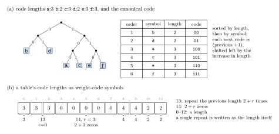

*Figure 3. (a) Six code lengths and the canonical code they define, as a tree and a table. A decoder can index a
table of `2^maxLength` entries by the next `maxLength` bits: here `000` and `001` decode `b`, `100` decodes `a`.
(b) A table's code lengths written as weight-code symbols (section 3.2): a repeat (13) for two more copies of 3, a
zero run (14) for five zeros, and lone lengths written as themselves.*

### 3.2 The weight code

The lengths of a block's tables are themselves Huffman-coded with the **weight code**, whose alphabet has 15 symbols:

| Symbol | Meaning in a table's length list |
|---|---|
| 0-12 | the next length is this value |
| 13 | repeat the previous length of this table `2 + r` more times: `r` = 2 bits; if `r` = 3, add 4 bits `x` (count `5 + x`); if `x` = 15, add 8 bits `y` (count `20 + y`) |
| 14 | `2 + r` zero lengths: `r` = 3 bits; if `r` = 7, add 6 bits `x` (count `9 + x`); if `x` = 63, add 8 bits `y` (count `72 + y`) |

The weight code's own 15 lengths (cap 7) are written plainly: 3 bits for the first length; then, for each next
length, 3 bits, and if it equals the previous length, a repeat count of further copies: 2 bits `r`; if `r` = 3, add 4
bits `x` (`r = 3 + x`); if `x` = 15, add 8 bits `y` (`r = 18 + y`). A count of 0 is allowed. The weight code must be a
valid, non-empty code (section 3.1) with cap 7.

### 3.3 Coded tables

A table's lengths follow the weight code as weight-code symbols (section 3.2) until the table's alphabet size is
reached. A repeat (13) copies the previous length of the same table and cannot be its first symbol; no run may pass
the end of the table. Each table is then checked against its cap (section 3.1).

The tables of one header are read in a fixed order, each from where the previous ended; the reference encoder lets
no run cross from one table into the next.

## 4. Parts shared by WZIP_L and WZIP_M

### 4.1 The one-call stream

```
size field | payload
```

The **size field** is 2 bytes if `n < 32768` (the `u16` value `n`, top bit 0), else 4 bytes: `u16` `0x8000 | (n & 0x7FFF)`,
then `u16` `n >> 15`. A size field of **0** marks a **stored** stream: the input follows uncompressed, and the stream's
remaining length is its size. Otherwise the payload is a WZIP_L payload if `n >= 32768` (section 5) and a WZIP_M payload
if `n < 32768` (section 6). The largest input is `0x7EEEE000` bytes.

The reference encoder stores inputs below 32 bytes and every input that compression would not shrink by at least
32 bytes, so no stream exceeds `n + 2` bytes.

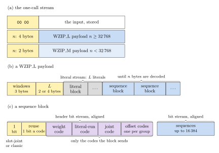

*Figure 4. (a) The three forms of a one-call stream. (b) A WZIP_L payload (section 5): the window header, the
literal count, the literal stream and the sequence blocks. (c) A sequence block (section 5.4): a header bit stream
with the block's coding bit, which codes it reuses, and the code tables it sends, then the size of stream A and the
two sequence streams, A with the even sequences and B with the odd ones.*

### 4.2 The literal stream

The literals of a WZIP_L or WZIP_M payload, `L` bytes in all, are coded in blocks of 32768 literals (the last block
holds the rest). Each block is one of:

- **stored**: a byte `0`, then the literals verbatim;
- **Huffman**: a byte `1`, a `u16` body size `B`, then a bit stream with the weight code (section 3.2) and the 256
  literal code lengths coded by it (cap 12; the code must not be empty), aligned; then the body of `B` bytes;
- **Huffman, reused code**: a byte `2`, a `u16` body size `B`, then the body of `B` bytes, coded with the code of the
  stream's last block of type `1` (invalid if there is none); values 3-255 are reserved and invalid.

The body of a Huffman block (types 1 and 2) holds:

- for a block of fewer than 512 literals: one bit stream of their codes;
- from 512 literals: three `u16` values `e0 <= e1 <= e2 <= B - 6`, then four bit streams starting at body offsets
  6, `6 + e0`, `6 + e1` and `6 + e2` (the fourth ends at the body's end). Streams 0-2 hold `q = (size >> 4) << 2`
  literals each, in order, and stream 3 the remaining `size - 3q`.

Each bit stream ends byte-aligned. The next block (or the next part of the payload) follows the body. (The
reference encoders reuse the last code where the block's literals take fewer bits with it than with a code of their
own plus its lengths: rarely within a stream, most often for a short last block.)

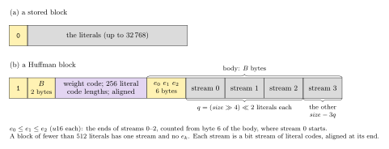

*Figure 5. A stored and a Huffman literal block (type 1; a block of type 2 lacks the code lengths). A Huffman block of
512 literals or more splits them into four streams, which a decoder can decode in parallel; the three `u16` values
give where streams 0-2 end.*

### 4.3 Offset values

An offset field codes a **value** `v`: values 0-3 select the offset cache (WZIP_L, WZIP_M) or the repeat slots
(WZIP_S, which uses values 0-2); larger values carry an offset. A value is coded as a symbol and raw bits:

- `v < 4`: symbol `v`, no extra bits;
- `v >= 4`: with `m = msb(v)`, symbol `2m + ((v >> (m - 1)) & 1)`, followed by the `m - 1` low bits of `v`.

Decoding symbol `s >= 4`: `e = (s >> 1) - 1`, `v = ((2 + (s & 1)) << e) + (e raw bits)`. An alphabet of `2w` symbols
codes values below `2^w`.

### 4.4 The offset cache (WZIP_L and WZIP_M)

Four recent offsets `c[0..3]`, most recent first, persist through the whole payload. A new offset `o` becomes
`c[0]` and the others move down (`c[3]` is dropped). Value `v < 4` uses `c[v]` and moves it to the front (the entries
before it move down one). Initially every entry is unset; a reference to an unset entry is invalid (the reference
decoders initialize them to `0x7F7F7F7F` in WZIP_L and `0xFFFFFFFF` in WZIP_M, offsets that no valid stream reaches).
For a new offset the value is `v = offset + 3`.

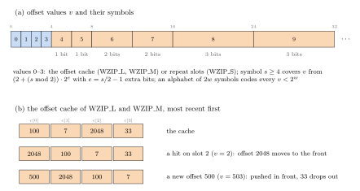

*Figure 6. (a) Offset values and symbols (section 4.3): values 0-3 have their own symbols; each larger symbol covers
a range of values twice as wide as the symbol two below it, with one more extra bit. (b) The offset cache: a hit
moves its entry to the front; a new offset is pushed in front and the oldest entry drops out.*

### 4.5 Matches

A match is valid if `1 <= offset <= p + D` (`p`: bytes decoded so far, `D`: the dictionary size, 0 without one) and it
ends at or before `n`. No stream records its dictionary: `WZIP_Decompress_L`, `WZIP_Decompress_M` and, for a one-call
stream of WZIP_L, `wzip_decompress_usingDict` take one, which must be the one the encoder was given. (A WZ frame of
linked blocks gives each block the content before it; `frame_format.md`, section 5.1.)

## 5. WZIP_L (n >= 32768)

### 5.1 Payload

```
window header (3 bytes) | literal count | literal stream | sequence block | sequence block | ...
```

The **literal count** `L` is a `u16` if `n < 65536`, else a `u32`; `L <= n`. The literal stream (section 4.2) holds `L`
literals. Sequence blocks follow until `n` bytes are decoded.

### 5.2 Windows

Each match length has a window **width** `w(l)`: a new offset of a length-`l` match is at most `2^w(l) - 4` (its value
`offset + 3` is below `2^w(l)`). Lengths 8 and up share `w(8)`, which is derived from the **history size**
`h = n + D`, where `D` is the size of the dictionary (section 8; 0 without one):
take the base width `b` from the table below, then `w(8)` is the smallest `w >= b` with `2^w - 3 >= h`, but at most 27.
(A stream with a dictionary thus has the windows of the end of one stream of `h` bytes.)

| `h` | base widths of lengths 3, 4, 5, 6, 7, 8 (`b` is the last) |
|---|---|
| `2^28 <= h` | 10, 15, 20, 24, 25, 26 |
| `2^26 <= h < 2^28` | 11, 15, 19, 23, 25, 26 |
| `2^25 <= h < 2^26` | 11, 15, 19, 22, 24, 24 |
| `2^24 <= h < 2^25` | 12, 16, 20, 22, 23, 23 |
| `2^23 <= h < 2^24` | 12, 16, 19, 22, 22, 22 |
| `2^22 <= h < 2^23` | 12, 15, 18, 21, 21, 21 |
| `2^21 <= h < 2^22` | 12, 15, 17, 20, 20, 20 |
| `2^20 <= h < 2^21` | 12, 15, 17, 19, 19, 19 |
| `2^19 <= h < 2^20` | 12, 15, 17, 18, 18, 18 |
| `2^18 <= h < 2^19` | 12, 15, 17, 17, 17, 17 |
| `2^17 <= h < 2^18` | 12, 15, 16, 16, 16, 16 |
| `2^15 <= h < 2^17` | 13, 14, 15, 15, 15, 15 |

The **window header** gives lengths 3-7 as gaps below `w(8)`, 4 bits each, and the offset grouping:

| Byte | Low nibble | High nibble |
|---|---|---|
| 0 | `w(8) - w(3)` | `w(8) - w(4)` |
| 1 | `w(8) - w(5)` | `w(8) - w(6)` |
| 2 | `w(8) - w(7)` | bit 0: offset grouping, 0 natural, 1 fine; bit 1: sized sequence blocks (version 2); bits 2-3 reserved, 0 |

Valid widths satisfy `w(3) >= 4` and `w(3) <= w(4) <= ... <= w(8)`. (The base widths of lengths 3-7 in the table are
the reference encoder's starting point; only `w(8)` is derived by the decoder.)

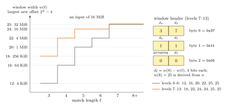

*Figure 7. The windows of a 16 MiB input. The base widths (levels 0-6) widen with the length up to `w(8) = 25`,
which covers the input; the optimal levels widen the short lengths' windows further. Right: the window header that
the optimal levels write, as three bytes of two nibbles each.*

### 5.3 Offset groups

New offsets are coded with one Huffman table per **group** of match lengths; a group's alphabet has `2w` symbols,
`w` being the widest window among its lengths. Let `i` be the smallest length in 3..8 with `w(i) = w(8)`.

- **Natural** grouping: `G = i - 2` groups: one per length 3, ..., `i - 1`, and one for lengths `i` and up (and runs).
  Alphabet of the group of length `l < i`: `2 w(l)`; of the last group: `2 w(8)`.
- **Fine** grouping: 8 groups: lengths 3, 4, 5, 6, 7, 8-9, 10-15, 16 and up (and runs); alphabets `2 w(l)` for the
  first five, `2 w(8)` for the others.

In terms of the length symbol `m` of section 5.5 (length `m + 3`; 67 for runs): the group is `min(m, G - 1)` with
natural grouping, and `min(m, 5) + [m >= 7] + [m >= 13]` with fine grouping.

### 5.4 Sequence blocks

A sequence block is a header bit stream, aligned; a `u24` size `S`; then two sequence bit streams, each aligned at
its end: **A**, of `S` bytes, holding the block's sequences 0, 2, 4, ..., and **B**, holding sequences 1, 3, 5, ...
(the block's sequences, each with all its fields). The next block follows B. A stream A that does not end
exactly `S` bytes after its start is invalid. (The codes of one bit stream decode one after another, as each code
starts where the previous one ends; two streams let a decoder decode two sequences at once.)

The header:

1. **1 bit**: 1 for a *slot-joint* block, 0 for a *classic* block;
2. with **sized sequence blocks** (the window header's flag) only: **14 bits**, the block's number of sequences less
   one (1-16384 sequences); otherwise a block holds 16384 sequences;
3. **1 bit per code**, in the order of item 5 (2 + the number of offset groups): 1 if the block **reuses** the code,
   0 if it sends it;
4. if the block sends a code: the weight code (section 3.2);
5. the coded tables (section 3.3) of the codes it sends, in this order:
   - the literal-run code: 71 symbols, cap 11;
   - the joint code: 1020 symbols (slot-joint) or 204 (classic), cap 11;
   - one offset code per group, in group order: the group's alphabet size, cap 10.

A reused code is the one the last block that sent it sent, the joint code only from a block of the same kind
(slot-joint or classic); reusing a code no earlier block of the payload sent is invalid. Any of these codes may be
empty (section 3.1) if the block does not use it; reading a symbol with an empty code is invalid. (The reference
encoders reuse a code where the block's symbols take fewer bits with it than with a code of their own plus its
lengths under the weight code.)

### 5.5 Sequences

Each sequence reads, in this order, from its stream (A or B, section 5.4):

1. **Joint symbol** `j`, giving a cache slot or "new" `t` (0-3, or 4), a literal-run class `k` (0-2) and a length
   symbol `m` (0-67):
   - slot-joint: `j = (3t + k) * 68 + m`;
   - classic: `j = 68k + m`, and `t = 4`.
2. **Literal run** `r`: `k = 0` gives 0 and `k = 1` gives 1; `k = 2` reads a literal-run symbol `s` (reference
   encoders use it for runs of 2 and more): `s < 32` gives `r = s`, else `r` follows the value table below.
3. If `r` reaches the end of the output (`r = n - p`, `p` the bytes decoded so far), this is the **last sequence**:
   its literals are output and decoding ends (it has no further fields). `r > n - p` is invalid.
4. **Offset**: if the block is classic or `t = 4`, an offset symbol is read with the code of the group of `m`
   (section 5.3), and its value `v` (section 4.3). In a slot-joint block, offset symbols 0-3 are not used. If `t < 4`,
   `v = t` and no offset symbol is read.
5. If `m = 67`, this is a **run**: `v >= 4`, and `v - 3` copies of the preceding output byte follow (a match of
   offset 1 and length `v - 3`, at most `2^w(8) - 4`); the offset cache is not changed and no length field follows.
6. Otherwise the offset is the cache entry `c[v]` for `v < 4` or the new offset `v - 3` (section 4.4), and the
   **match length** is `m + 3` if below 32, else it follows the value table below for `s = m + 3` (lengths up to 4095).
7. The `r` literals (the next ones of the literal stream) are output, then the match is copied (section 4.5).

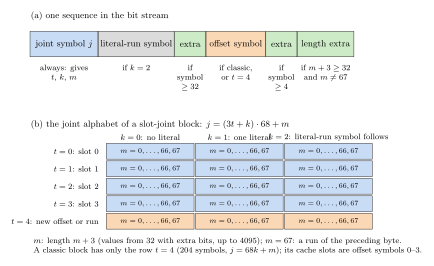

*Figure 8. (a) The fields of one sequence, in bit-stream order, with the condition under which each is present.
(b) The joint alphabet of a slot-joint block: 5 slots by 3 literal-run classes by 68 length symbols. One symbol
decides whether an offset field follows (row `t = 4`) or the offset comes from the cache (rows 0-3).*

Value table (WZIP_L literal-run symbols 32-70, and match lengths from 32):

| `s` | value | extra bits |
|---|---|---|
| 32-47 | `(s - 16) * 2 + x` (32-63) | 1 |
| 48-55 | `(s - 40) * 8 + x` (64-127) | 3 |
| 56-59 | `(s - 52) * 32 + x` (128-255) | 5 |
| 60-63 | `(s - 56) * 64 + x` (256-511) | 6 |
| 64-65 | `(s - 62) * 256 + x` (512-1023) | 8 |
| 66-67 | `(s - 64) * 512 + x` (1024-2047) | 9 |
| 68-69 | `(s - 66) * 1024 + x` (2048-4095) | 10 |
| 70 | `x` (literal runs only: 0 to `2^24 - 1`) | 24 |

Decoding continues block after block until `n` bytes are decoded. A block holds 16384 sequences, or with sized blocks
the number its header gives; only the payload's last block may end early, with the last sequence (step 3). (If a
block's last sequence completes the output, decoding ends there; the reference encoder writes the last sequence in a
further block, which decoders do not need to read.)
After the last sequence all `L` literals have been consumed.

### 5.6 Validity

Beyond sections 3 and 4.5, a decoder must reject a payload whose window header is invalid, whose literal count
exceeds `n`, whose literal stream or sequence blocks extend past the input, whose literal runs consume more than `L`
literals or pass the end of the output, or that ends before `n` bytes are decoded.

## 6. WZIP_M (n < 32768)

### 6.1 Payload

```
literal count (u16) | literal stream | table header | stream A ... stream B (byte-reversed)
```

The literal count `L <= n` and the literal stream are as in WZIP_L (sections 4.2, 5.1).

The **table header** is a bit stream: the weight code (section 3.2), then the coded tables (cap 9 each; any may be
empty): literal runs (32 symbols), match lengths (28 symbols), offsets of length 3 (26 symbols: new offsets up to
`2^13 - 4`), offsets of lengths 4 and up (30 symbols: up to `2^15 - 4`); aligned.

The **sequence streams**: sequences 0, 2, 4, ... are in stream A, which starts after the header and is read forward;
sequences 1, 3, 5, ... are in stream B, which is stored byte-reversed at the end of the payload: its first byte is the
payload's last byte, its second byte the one before, and so on. Both streams end byte-aligned, and together they
fill the payload exactly (so the payload size must be known exactly).

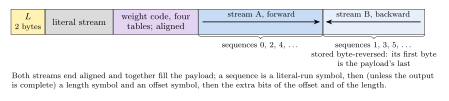

*Figure 9. A WZIP_M payload. Even sequences are read forward from after the tables, odd ones backward from the
payload's end, so that a decoder can follow two independent bit positions.*

### 6.2 Sequences

Value codes (WZIP_M and WZIP_S): a code `c` gives a value with extra bits:

| `c` | value | extra bits |
|---|---|---|
| 0-7 | `c` | 0 |
| 8-11 | `8 + 2(c - 8) + x` | 1 |
| 12-15 | `16 + 4(c - 12) + x` | 2 |
| 16-19 | `32 + 8(c - 16) + x` | 3 |
| 20-21 | `64 + 32(c - 20) + x` | 5 |
| 22-23 | `128 + 64(c - 22) + x` | 6 |
| 24, 25, ..., 31 | `2^(c - 16) + x` | `c - 16` |

Each sequence, in its stream:

1. **literal-run symbol** `c`, and its value `r` (value code, with its extra bits);
2. if `r` reaches the end of the output, this is the last sequence: its literals are output and decoding ends;
3. **length symbol** `m` (0-27);
4. **offset symbol** with the code of length 3 if `m = 0`, else of lengths 4 and up, and its value `v`
   (section 4.3); the offset is the cache entry or the new offset (section 4.4);
5. the match length: the value of value code `m + 3` (with its extra bits): 3 to 32767;
6. the `r` literals are output, then the match is copied.

There are no runs and no joint symbols. After the last sequence all `L` literals have been consumed.

## 7. WZIP_S blocks

WZIP_S compresses independent blocks of 1 to 32768 bytes (`WZIPS_compress`). It does not use the one-call stream.

### 7.1 Header

Byte 0:

| Bits | Field |
|---|---|
| 0-1 | mode: 0 stored, 1 fill, 2 Huffman (3 invalid) |
| 2-3 | size class: 0 for 4096 bytes, 1 for 8192, 2 for 16384, 3 explicit |
| 4 | 1 if the block needs a dictionary (Huffman mode only) |
| 5-7 | format version: 0 |

With size class 3, a `u16` follows holding `n - 1`. Then:

- **stored**: the `n` bytes (the block's size is exactly header + `n`);
- **fill**: one byte, repeated `n` times (the block is header + 1 byte);
- **Huffman**: the body, which extends to the end of the block (the block size must be known exactly).

### 7.2 Windows

With `D` the dictionary size (at most its last 32767 bytes are used; 0 without), let `wb` be the smallest `w >= 1`
with `2^w >= n`, and `wf` the smallest `w >= wb` with `2^w >= n + D`. Offsets of all lengths from 3 reach the whole
history (`n + D`); the reference encoder admits length-3 matches only within `2^min(12, wf - 1)` bytes. The offset
alphabet has `2 wf + 1` symbols (4 if `wf <= 1`).

### 7.3 Body

The body holds a **main stream**, read forward from the body's start, and **stream B**, stored byte-reversed so that
it ends at the block's end (its first byte is the block's last byte). Blocks above 2 KiB (`wb >= 12`) also hold
streams C and D, which meet at a point **P** of the body: C is stored byte-reversed so that it ends at P (its first
byte is the byte before P) and is read backward from P; D starts at P and is read forward. The main stream holds:

1. the weight code, then the coded tables: literals (256 symbols, cap 10; empty only if there are no literals),
   literal runs (32 symbols, cap 9, not empty), match lengths (30 symbols, cap 9), offsets (`2 wf + 1` symbols, cap 9);
2. the literal count `L` in `wb + 1` bits (`L <= n`);
3. four-stream blocks only: the number of bytes from P to the body's end, in `wb` bits (at most the body's size);
4. the main stream's share of the literals, as Huffman codes;
5. the sequences' literal runs and lengths (section 7.4), then align.

Streams C and D hold literal codes only, each ending byte-aligned. Stream B holds its share of the literals, then the
sequences' offset fields, then align. The streams fill the body exactly: the main stream and stream B meet, or, in
four-stream blocks, the main stream and C meet before P, and D and B after it.

Literal shares, in literal order: with two streams, the main stream holds the first `ceil(L/2)` literals and B the
rest; with four streams (`q = L >> 2`), C holds literals `[0, q)`, D `[q, 2q)`, the main stream `[2q, 3q)` and B
`[3q, L)`.

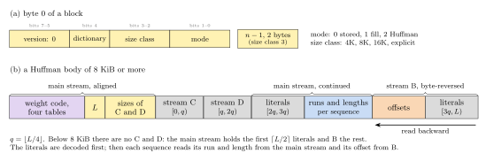

*Figure 10. (a) The first byte of a WZIP_S block. (b) A Huffman body of a block above 2 KiB, in storage order: the
main stream, stream C, which is stored byte-reversed and read backward from the point P that the main stream gives,
stream D, read forward from P, and stream B, stored byte-reversed and read from the block's end. One point serves
two streams; no stream size is stored.*

### 7.4 Sequences

Three **repeat slots** `rep = (1, 4, 8)` initially. Each sequence:

1. main stream: **literal-run symbol** (value code, section 6.2) and its extra bits: run `r`. The `r` next literals
   are output. If the output is now complete, decoding ends (all `L` literals must have been used); otherwise:
2. main stream: **length symbol** `s` (0-29):
   - 0: length 2 with a raw offset (not produced by the reference encoder, built with `S_W2_BITS = 0`; a decoder of
     that build rejects it);
   - 1: length 2 at offset `rep[0]`; no offset field, and the slots do not change;
   - 2-29: the length is the value of value code `s + 1` with its extra bits (3 to 32767);
3. stream B, for `s >= 2`: an **offset symbol** and its value `v` (section 4.3): `v = 0` uses `rep[0]`; `v = 1`
   uses `rep[1]` and swaps `rep[0]`, `rep[1]`; `v = 2` uses `rep[2]` and moves it to the front; `v >= 3` is the
   offset `v - 2`, which becomes `rep[0]` (the others move down);
4. the match is copied (section 4.5, with the dictionary of section 7.2).

## 8. Dictionaries

WZIP_L and WZIP_M (through `WZIP_New_State_L`/`_M` and `WZIP_Decompress_L`/`_M`; WZIP_L also through
`wzip_compress_usingDict` and `wzip_decompress_usingDict`, and in WZ frames of linked blocks) and WZIP_S
(`WZIPS_createCDict`, `WZIPS_decompress_usingDict`) let a dictionary precede the input: positions `-D..-1` hold its last `D` bytes, and
offsets reach into it as into earlier output (section 2). A match that starts in the dictionary may run on past its
end into the output, as positions run on from `-1` to `0`. Only WZIP_S records in the block that one is needed.
WZIP_L derives its windows from the dictionary and output sizes together (section 5.2), so a block reaches as far
into its dictionary as one stream reaches back; the decoder must be given the same dictionary size as the encoder.

The reference encoder of WZIP_L searches a dictionary at every level: the hash-chain levels from tables built over
it, and the optimal levels by inserting its positions within each window into their two chains and their binary tree
before the input. (Before October 2026 the optimal levels found only matches of 3-6 bytes in a dictionary, no
level let a match run past its end, and WZIP_L's windows followed `n` alone, which made streams with a dictionary
incompatible with this version.) Splitting enwik9 into blocks of 128 MiB, each compressed at level 11 with the
128 MiB before it as its dictionary, costs 0.19% of the ratio of one stream; without the dictionaries, 3.8%.

## 9. Reference decoders (informative)

- `wzip_decompress` and `WZIPS_decompress` check the rules above and are written never to read or write outside
  their buffers, whatever the input; `wzip_decompress_trusted` skips the checks for input known to come from the
  encoder and is up to 8% faster on Silesia. (For a few rules the C decoders are more lenient than
  `doc/wzip_decode.py`, which rejects, for example, unused literals left at the end.)
- The literal stream's Huffman blocks are decoded with a single-symbol table (one lookup of the longest code's width
  per literal) or, when the block compresses well, a double-symbol table; four streams are decoded in parallel.
- The sequence decoder of WZIP_L reads one joint symbol per sequence: in slot-joint blocks its table entry holds the
  slot, class and length symbol, so the cache hit, the literal-run class and the length need one lookup; the
  literal-run table is looked up for every sequence and consumed only for class 2, which avoids a branch. Offset
  tables are built at the full 10-bit width so that one shift serves all groups.
- On large inputs a match often reaches beyond the L2 cache, and the copy waits on memory. WZIP_L's decoders count
  the matches at offsets of 1 MiB or more and, when the previous block had at least 16 per KiB of output, decode the
  next block as a pipeline, as Zstandard's long-offset decoder does: each step decodes one sequence and prefetches
  its match's source, and executes the sequence decoded 16 steps before. At level 11 on an AMD EPYC 9334 this decodes
  enwik8 44% and enwik9 62% faster, leaving Silesia unchanged; on inputs whose matches stay in cache the pipeline
  would cost up to 8%, which the rule avoids. The format is unchanged.
- WZIP_M reads two sequences per round, from streams A and B, so that their table lookups overlap; WZIP_S decodes
  all literals first from two or four streams, then the sequences with offsets from a separate stream. WZIP_S's
  literal-run, length and offset tables hold each symbol's value and extra-bit count beside its code length, so that
  a field takes one lookup and one shift.

## 10. Reference encoders (informative)

| Codec | Levels | Parsing |
|---|---|---|
| WZIP_L | 0 | one hash table on 6-byte seeds, 1 MiB window, skips faster in incompressible data |
| | 1 | hash tables for each length class, no chains |
| | 2-3, 4-6 | greedy (2-3) and lazy (4-6) parsing with hash chains per length class |
| | 7-13 | optimal parsing (a bounded shortest path priced in 1/256 bit from running symbol statistics); from 7 the windows of lengths 3-5 are widened; 12-13 keep three path states per position (one per literal-run class); 13 makes a first pass for per-region prices and uses the fine offset grouping |
| WZIP_M | 0, 1-9, 10-12 | fast, hash-chain, optimal (the one-call interface uses levels up to 12) |
| WZIP_S | 1-9 | greedy (1-2) or lazy parsing with a 3-byte hash chain of 4 to 4096 steps; literal codes of at most 9 bits in blocks up to 8 KB (10 above) |

From level 2, WZIP_L writes sized sequence blocks (version 2; levels 0-1 write version 1 streams): it splits each
buffer of 16384 sequences in halves, recursively down to 1024 sequences, wherever the halves, each with codes of its
own, are estimated to take fewer bits than the whole (the codes' symbols at their entropy, in integer arithmetic, plus
their lengths and a fixed cost per block, which also stands for the decoder's table builds). On Silesia this gains
0.3-0.4% (most on xml, mozilla and mr) and leaves uniform text such as enwik8 unchanged.

Each level of WZIP_L searches at most its own window: 2^27 bytes at the top level of each parser (6 and 13) and one
bit less per level below it, so 2^21 at levels 0 and 7 (level 0 searches 1 MiB in any case). It caps the widest of
the windows of section 5.2, which the input's size sets, and each narrower window moves down just enough to stay
below the next wider one, so that the windows keep their order (on enwik9, lengths 3, 4, 5-7 and 8+: 2^19, 2^23,
2^25, 2^27 at level 13; 2^19, 2^23, 2^24, 2^25 at level 11; 2^18, 2^19, 2^20, 2^21 at level 7). These windows size
the encoder's tables, so that memory follows the level. The stream keeps the windows of section 5.2 (its offset
codes), so decoders need no level, and an input no larger than a level's window compresses as at the top level of
its parser.

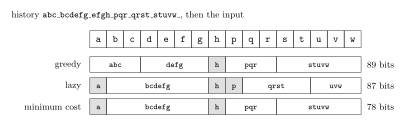

*Figure 11 (from the IEEE Trans. IT paper, [arXiv:2610.06530](https://arxiv.org/abs/2610.06530), `papers/WLZ.pdf`).
Three parses of one input, with literals of 9 bits (shaded) and matches of 20 bits: greedy, lazy and minimum cost. WZIP's levels 2-3 parse greedily, 4-6 lazily, and
7-13 approximate the minimum-cost parse with prices from running symbol statistics.*

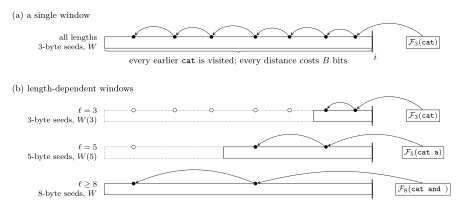

*Figure 12 (from `papers/WLZ.pdf`). One index per class of lengths, each on seeds of its shortest length and covering
only its window, searched nearest first. WZIP's optimal levels use a 3-byte chain for lengths 3-4 searched to
`W(4)`, a 5-byte chain for lengths 5-6 searched to `W(6)`, and a binary tree on 7-byte seeds over the whole window;
the short seeds' indexes stay small because their windows are.*

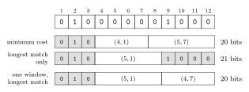

*Figure 13 (from `papers/WLZ.pdf`). Why a parser must price shorter lengths of a candidate under length-dependent
windows: with window 1 for lengths 2-4 and 8 for lengths 5-8, the cheapest parse takes the shorter match `(4,1)`,
because the remaining `1000` has its only copy at distance 7, which only lengths of 5 or more may reach. WZIP's
optimal parser therefore prices each length with the nearest candidate whose window admits it.*

Every WZIP_L block chooses slot-joint or classic coding by estimated size. The windows, levels and measurements are
discussed in the paper (`papers/WZIP_WLZ4_DCC.pdf`); results are in `results/`.

**Count limits.** Two WZIP_L fields bound a count: a literal run codes at most `2^24 - 1` literals (symbol 70), and a
run at most `2^w(8) - 4` copies (its value must fit the last group's alphabet). The reference encoder splits longer
runs into several runs; a literal run of `2^24` or more (about 16 MiB of input in which no match is found, which ordinary
data does not produce) makes WZIP_L fail, and `wzip_compress` then stores the input. (Before October 2026 the encoder
did neither, and such inputs, for example more than 128 MiB of one repeated byte, produced streams that do not decode.)
