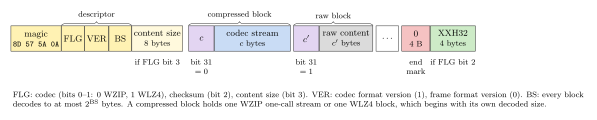

# The WZ frame format

This document specifies the **WZ frame**, the container in which the command-line tool and the frame API
(`src/wzframe.h`) store WZIP and WLZ4 data. A frame identifies its content (magic number, codec, format version),
holds it as a series of blocks of bounded size, and may record the content size and a checksum. The blocks are
the codecs' own streams, specified in [`WZIP_format.md`](WZIP_format.md) (the one-call stream) and
[`WLZ4_format.md`](WLZ4_format.md) (a block).

Everything here is normative except where marked informative. `doc/frame_decode.py` is an independent decoder of
this format, written from this document and handing the blocks to the codecs' reference decoders. It decodes 42
frames of six Canterbury and Calgary files written by `WZF_compress` (both codecs, levels from fast to optimal, one
block or blocks of 1 to 4 KiB, with and without checksum) identically to the input, and its XXH32 agrees with the
check values below.

Frame format version: 0 (October 2026).

## 1. Why a frame

A codec stream alone is enough when an application stores the compressed size and knows which codec and format
produced the data. A file needs more:

- **Identification.** A magic number tells a WZ frame from anything else, and the frame names its codec and the
  version of that codec's format, so that a later format can be told from this one and an unknown one is refused
  rather than misdecoded.
- **Integrity.** An optional checksum of the content detects damage that leaves a valid stream.
- **Size and memory.** Blocks bound the memory of both sides, let content of any size (beyond a codec's 2 GB) be
  compressed and decompressed piece by piece, from a pipe, and can be decoded in parallel.

## 2. Conventions

Multi-byte integers are little-endian. `u32` is 4 bytes, `u64` 8 bytes. XXH32 is the 32-bit xxHash function with
seed 0 (section 8).

## 3. Layout

A WZ file or stream is a sequence of **frames** and **skippable frames**, in any order; its content is the
concatenation of the frames' contents.

```
frame:           magic | descriptor | [content size] | block ... | end mark | [checksum]
skippable frame: skippable magic | size | data
```



*Figure 1. A frame: the magic number, the 3-byte descriptor, the optional content size, blocks (each a 4-byte
header and its data), the end mark and the optional checksum.*

## 4. Frame header

| Field | Bytes | Value |
|---|---|---|
| magic | 4 | `8D 57 5A 0A` (`u32` `0x0A5A578D`) |
| FLG | 1 | flags, below |
| VER | 1 | bits 0-3: codec format version; bits 4-7: frame format version, 0 |
| BS | 1 | block size log `b`, `10 <= b <= 31`: every block decodes to at most `2^b` bytes |
| content size | 0 or 8 | `u64`, present if FLG bit 3 is set: the size of the frame's content |

FLG:

| Bits | Field |
|---|---|
| 0-1 | codec: 0 WZIP, 1 WLZ4; 2 and 3 reserved |
| 2 | 1: a content checksum follows the end mark |
| 3 | 1: the content size follows the descriptor |
| 4-7 | reserved, 0 |

Codec format versions: **1** for both codecs, the formats of October 2026 specified in `WZIP_format.md` and
`WLZ4_format.md`. (WLZ4's format changed in October 2026, before frames existed; there is no version 0 frame.)

The magic number's first byte is not ASCII, so a channel that strips the eighth bit spoils it; its last byte is a
line feed, so a text-mode conversion to CR LF spoils it too.

A decoder must reject a frame with an unknown magic number, a reserved codec, a codec format version or frame
format version it does not implement, a block size log outside 10-31, or a reserved bit set.

## 5. Blocks

Each block is a `u32` **block header** followed by its data:

| Bits of the header | Field |
|---|---|
| 0-30 | `c`, the size of the block's data in bytes, at least 1 |
| 31 | 1: a **raw** block; 0: a **compressed** block |

- A **raw** block's data is `c` bytes of content, verbatim (`c <= 2^b`).
- A **compressed** block's data is one complete codec stream of exactly `c` bytes: for WZIP, a one-call stream
  (`WZIP_format.md`, section 4.1, which begins with its own decoded size); for WLZ4, a block (`WLZ4_format.md`,
  section 3, which also begins with its decoded size). Its decoded size must be at least 1 and at most `2^b`.

The **end mark** is a block header of value 0. A frame with no content has no blocks.

Blocks are independent: no block refers to the content of another. Every block decodes to at most `2^b` bytes; they
need not all have the same size.

## 6. End of frame

After the end mark:

- if FLG bit 2 is set, a `u32` **checksum**: XXH32 of the frame's content;
- if FLG bit 3 is set, the content size must equal the total decoded size of the blocks.

A decoder must reject a frame whose checksum or content size does not match, and a frame that ends before its end
mark or checksum.

## 7. Skippable frames

A **skippable frame** begins with a `u32` magic number from `0x184D2A50` to `0x184D2A5F`, then a `u32` size `s`,
then `s` bytes of data that decoders ignore. Applications may use them for metadata. The same range marks
skippable frames in the LZ4 and Zstandard frame formats.

## 8. XXH32

XXH32 of `n` bytes, with the constants `P1 = 0x9E3779B1`, `P2 = 0x85EBCA77`, `P3 = 0xC2B2AE3D`, `P4 = 0x27D4EB2F`,
`P5 = 0x165667B1` and all arithmetic modulo `2^32` (`rotl(x, r)`: rotation left by `r` bits):

1. If `n >= 16`: `v1 = P1 + P2`, `v2 = P2`, `v3 = 0`, `v4 = -P1`; for each full 16-byte stripe, each `vi` takes the
   `i`-th `u32` `x` of the stripe: `vi = rotl(vi + x * P2, 13) * P1`. Then `h = rotl(v1, 1) + rotl(v2, 7) +
   rotl(v3, 12) + rotl(v4, 18)`. Otherwise `h = P5`.
2. `h = h + n`.
3. For each remaining `u32` `x`: `h = rotl(h + x * P3, 17) * P4`.
4. For each remaining byte `y`: `h = rotl(h + y * P5, 11) * P1`.
5. `h ^= h >> 15`; `h *= P2`; `h ^= h >> 13`; `h *= P3`; `h ^= h >> 16`.

Check values: XXH32 of no bytes is `0x02CC5D05`, of `abc` `0x32D153FF`.

## 9. The reference encoder (informative)

`WZF_compress` and the command-line tool write format version 0 frames with codec format version 1. They write the
content size when it is known (always for `WZF_compress`, and for regular files in the tool) and the checksum
unless asked not to. The block size log defaults to the smallest `b >= 16` with `2^b` at least the content size, at
most 30 (1 GiB), so that content up to 1 GiB is one block and compresses as in the benchmarks; content of unknown
size (a pipe) uses `b = 27` (128 MiB) for WZIP and `b = 23` (8 MiB) for WLZ4, the codecs' widest windows. A block
that does not shrink is written raw.

The overhead is 11 to 23 bytes per frame (header, end mark, checksum) plus 4 bytes per block.
